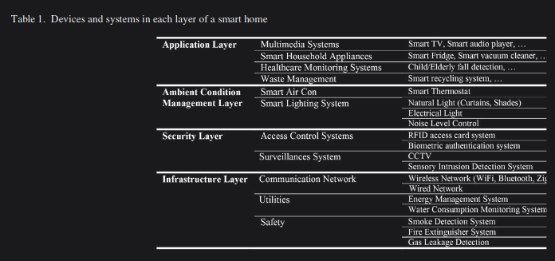

- [[Actuators]]
- [[Sensors]]
- [[Communication Protocols]]
-  #[[Published 2022]] #[[Review Paper]]
	- [Source](https://www.mdpi.com/1424-8220/22/21/8564)
-  #[[Published 2019]] #Actuators
	- [Source](https://dl.acm.org/doi/abs/10.1145/3351256)
	- 3 attacks listed in paper
		- 1st two infer users' audio/video playback using systematic observation and analysis of the multimedia-visualization functionality of smart light bulbs
		- 3rd attack uses the infrared capabilities of smart light bulbs to create a covert-channel to ex-filtrate user's private data out of secured home or office network.
-  #[[Unpublished]] #[[Review Paper]]
	- [Source](https://arxiv.org/abs/2408.14613)
-  #[[Published 2023]] #[[Communication Protocols]]
	- [Source](https://dl.acm.org/doi/abs/10.1145/3603165.3607446)
-  #[[Published 2022]]
	- [Source](https://ieeexplore.ieee.org/abstract/document/9763029)
	- This is an EM injection attack, out of scope for the research : (
- Many articles are referencing [[ZigBee]] signals and packets should research this
-  #[[Published 2021]] #[[Communication Protocols]]
	- [Source](https://ieeexplore.ieee.org/abstract/document/9505165)
-  #[[Published 2018]] #[[Review Paper]]
	- [Source](https://ieeexplore.ieee.org/abstract/document/8718722)
-  #[[Published 2022]] #[[Communication Protocols]]
	- [Source](https://dl.acm.org/doi/abs/10.1145/3548606.3560703)
-  #[[Published 2017]] #[[Conference Paper]]
	- [Source](https://ieeexplore.ieee.org/abstract/document/8217429)
	- Lists Side Channel Attack Categories
	- Data Privacy Protection in two Major categories:
		- Protecting Sensitive and private content of messages transmitted through the home network.
		- Concerns about the context of data, such as:
			- identities of communicators
			- temporal data
			- absolute/relative locations of targeted smart devices
	- This paper about SCAs that attack the contextual data (the second category)
	- C. Electromagnetic Analysis:
		- > Cryptographic devices performing encryption or decryption tasks emit power radiation of electromagnetic fields. In this type of attack, adversaries exploit leaked radiation for performing electromagnetic analysis to find correlations between leaked radiation and ciphertext. Since this radiation can be captured remotely, depending on the receiver equipment strength, this side-channel attack can be performed from a distance and hackers do not need to be close to the target [20].
			- The reference:
				- J. Longo, E. De Mulder, D. Page, and M. Tunstall, "SoC it to EM: electromagnetic side-channel attacks on a complex system-onchip," in International Workshop on Cryptographic Hardware and Embedded Systems, 2015, pp. 620-640.
	- 
	-
	-
	-